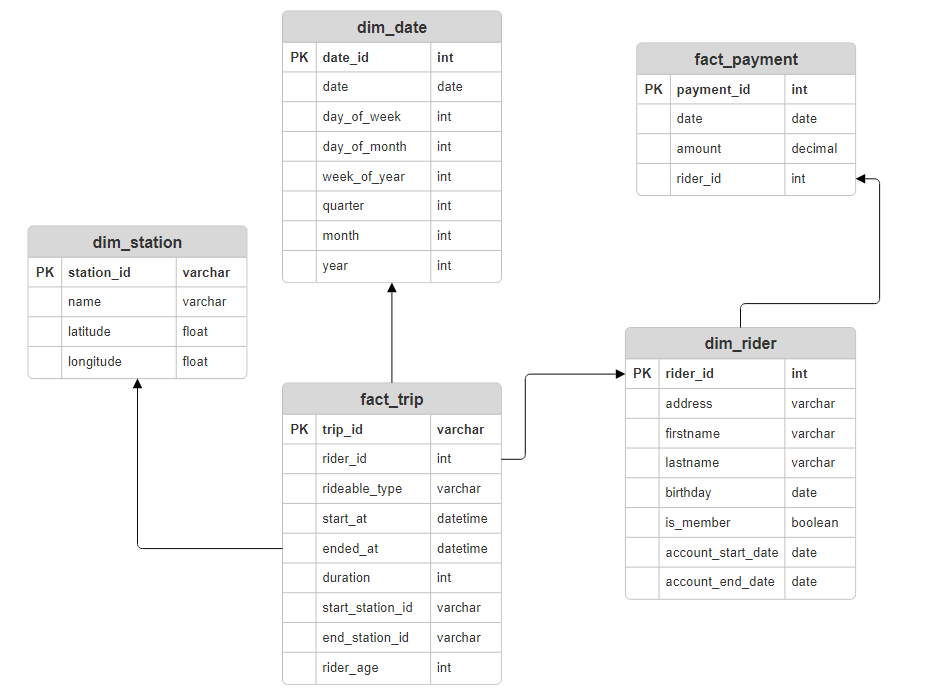
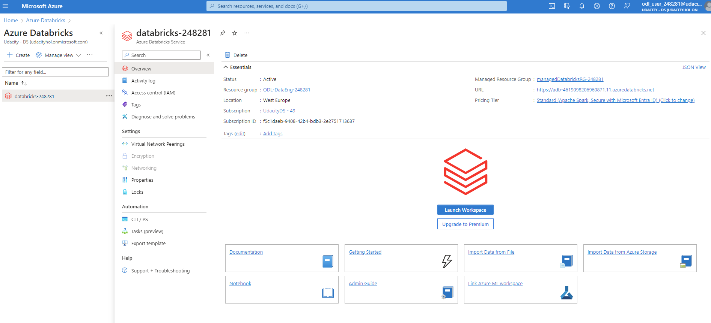
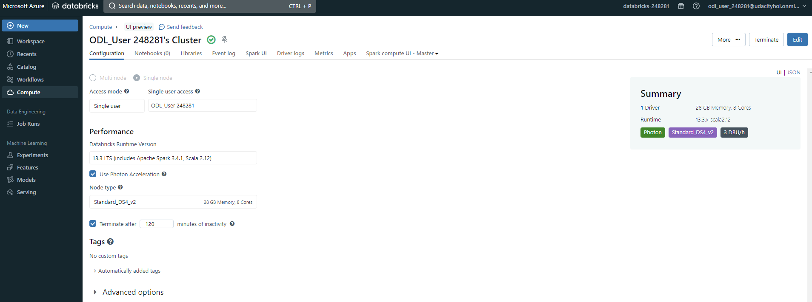
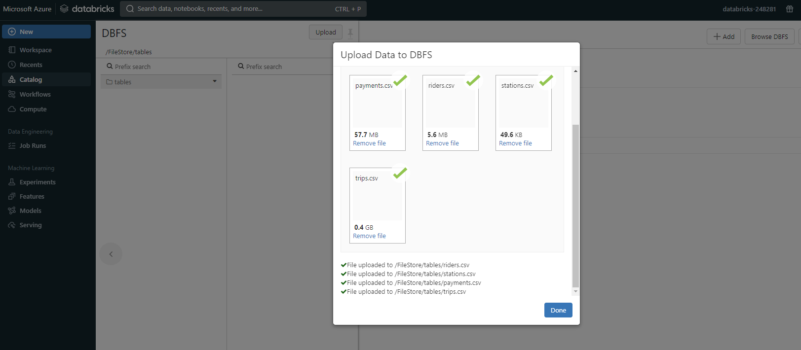
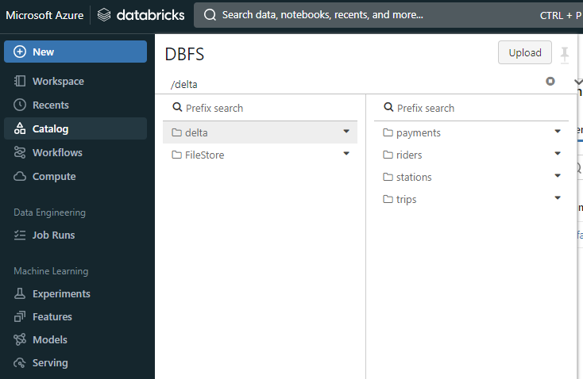
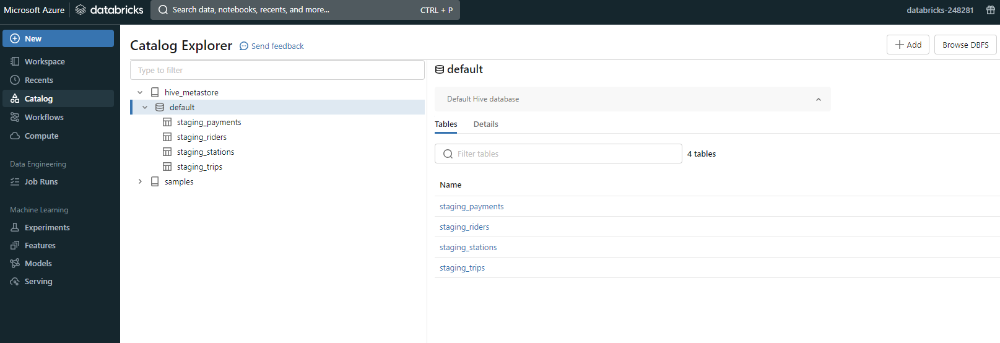
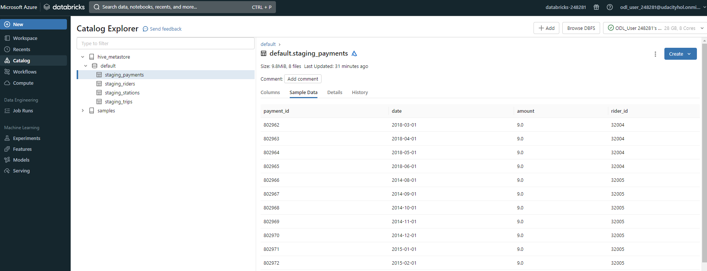
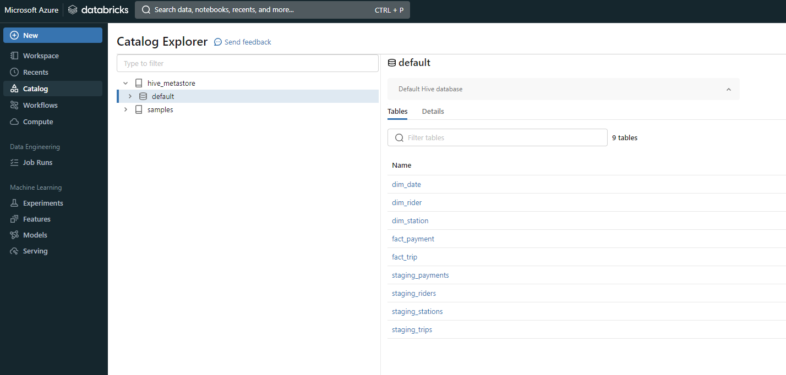
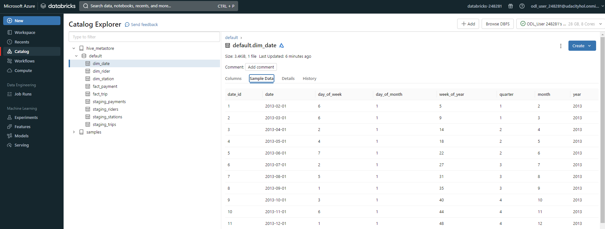

# Building an Azure Data Lake for Bike Share Data Analytics

## Project overview

In this project, you'll build a data lake solution for Divvy bikeshare.

Divvy is a bike sharing program in Chicago, Illinois USA that allows riders to purchase a pass at a kiosk or use a mobile application to unlock a bike at stations around the city and use the bike for a specified amount of time. The bikes can be returned to the same station or to another station. The City of Chicago makes the anonymized bike trip data publicly available for projects like this where we can analyze the data.

Since the data from Divvy are anonymous, we have generated fake rider and account profiles along with fake payment data to go along with the data from Divvy. The dataset looks like this:

### The goal of the project

To develop a data lake solution using Azure Databricks using a lake house architecture. We will:

* Design a star schema based on the business outcomes listed below;
* Import the data into Azure Databricks using Delta Lake to create a Bronze data store;
* Create a gold data store in Delta Lake tables;
* Transform the data into the star schema for a Gold data store;

### The business outcomes we are designing for are as follows:

1. Analyze how much time is spent per ride
* Based on date and time factors such as day of week and time of day
* Based on which station is the starting and / or ending station
* Based on age of the rider at time of the ride
* Based on whether the rider is a member or a casual rider

2. Analyze how much money is spent
* Per month, quarter, year
* Per member, based on the age of the rider at account start

3. EXTRA CREDIT - Analyze how much money is spent per member
* Based on how many rides the rider averages per month
* Based on how many minutes the rider spends on a bike per month

## Tasks that need to be completed

### Task 1: Design a star schema based on the business outcomes

The star schema based on the provided dataset looks like this:

### Task 2: Import the data into Azure Databricks using Delta Lake to create a Bronze data store

The very first thing would be to create Azure Databricks workspace. Since this a cloud lab, then the resource was already provided by Udacity:

Next, create the Azure Databricks cluster. For this project, it was strongly recommended to create a single-node cluster:

Next, upload the files to DBFS:

After creating the Extract notebook, the data is imported to Azure Databricks in delta format:

### Task 3: Create a gold data store in Delta Lake tables

After creating the Load notebook, the staging tables are created and the data is loaded into those tables:

The example data can be seen from the tables:

### Task 4: Transform the data into the star schema for a Gold data store

After creating the Transform notebook, the data in staging tables is transformed into star schema and the tables can be seen in the workspace:

Table dim_date example data:

